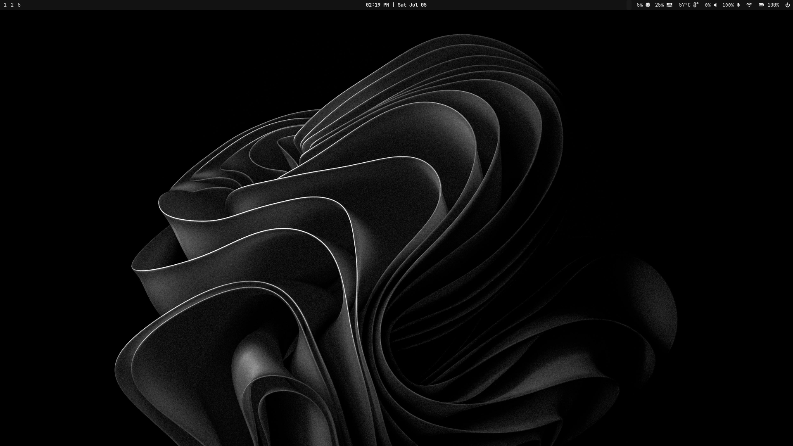
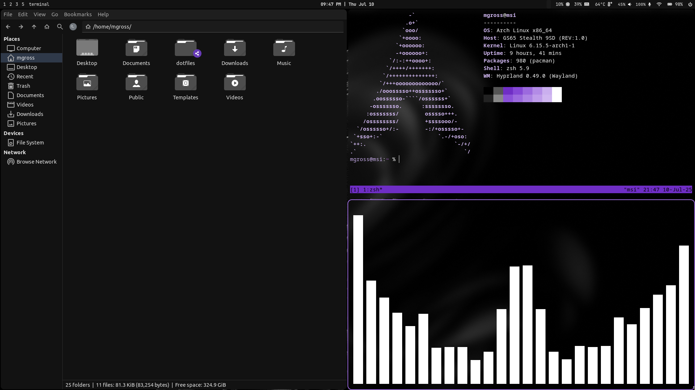

# Dotfiles & Installation




## System Info

| **Component**     | **Details**                                                          |        **Notes**            |
|-------------------|----------------------------------------------------------------------|-----------------------------|
| **Kernel**        | [Linux](https://github.com/torvalds/linux)                           |  Year of the Linux Desktop  |
| **Distribution**  | [Arch](https://archlinux.org)                                        |       *Arch btw*            |
| **Window Manager**| [Hyprland](https://wiki.hyprland.org)                                |    Tiling / Wayland         |
| **Graphics**      | [NVIDIA](https://wiki.archlinux.org/title/NVIDIA)                    |     Proprietary Drivers     |
| **GRUB Theme**    | [Dark Mojave](https://github.com/vinceliuice/Elegant-grub2-themes)   |      Right Window           |
| **Terminal**      | [Alacritty](https://github.com/alacritty/alacritty)                  | Fast, GPU-accelerated       |
| **Shell**         | [Zsh](https://www.zsh.org)                                           |    Z-Shell (*"zish"*)       |
| **Font**          | [Ubuntu](https://design.ubuntu.com/font/)                            |         *sacrilegious*      |
| **System Theme**  | [Materia Dark Compact](https://github.com/nana-4/materia-theme)      |      Based on Adwaita       |
| **Icon Theme**   | [Tela Circle](https://github.com/vinceliuice/Tela-circle-icon-theme)  |       Black, Dark           |

## Download ISO

[Download Arch Linux ISO](https://archlinux.org/download/)

Use tool like Rufus to flash `.iso` to boot drive

## Installation Script

```bash
git clone --bare https://github.com/MGross21/dotfiles.git ~/.dotfiles
./install.sh
```

<!-- ### Making Changes

```bash
alias dotfiles='/usr/bin/git --git-dir=$HOME/.dotfiles --work-tree=$HOME'
dotfiles checkout
dotfiles config --local status.showUntrackedFiles no
```

#### Examples

```bash
dotfiles status
dotfiles add .vimrc
dotfiles commit -m "Update vim config"
``` -->

### Arch on WSL2

<sub>For instructions directly from Arch Linux forums, [see here](https://wiki.archlinux.org/title/Install_Arch_Linux_on_WSL)</sub>

#### Installation

1. Open Command Prompt <kbd> Win</kbd> + <kbd>R</kbd>, type <kbd>cmd</kbd>, press <kbd>Enter</kbd>.
2. Run the following commands

> [!Note]
> You may need to restart your wsl session or computer during setup. <br>
> *To restart wsl session, run: `wsl --terminate arch` *<br>
> *To restart from PowerShell, run: `Restart-Computer`*

```bash
winget install Microsoft.WSL
wsl --update
wsl --set-default-version 2
wsl --install -d archlinux --web-download --no-launch --name arch
wsl --set-default arch # required if other distrobutions exist
wsl --manage arch --set-default-user $env:USERNAME # set default username to same as windows computer
wsl ~
pacman -Syu
```

#### Terminate Session

```bash
wsl --terminate arch
```

#### Uninstall

```bash
wsl --unregister arch
```

### User Setup

Create a new user and grant sudo privileges:

1. Add a user:

```bash
useradd -m -G wheel -s /bin/bash <username>
passwd <username>
```

2. Edit the sudoers file:

```bash
EDITOR=nano visudo
```

Uncomment:

```plaintext
%wheel ALL=(ALL) ALL
```

3. Switch to the new user:

```bash
su - <username>
```
